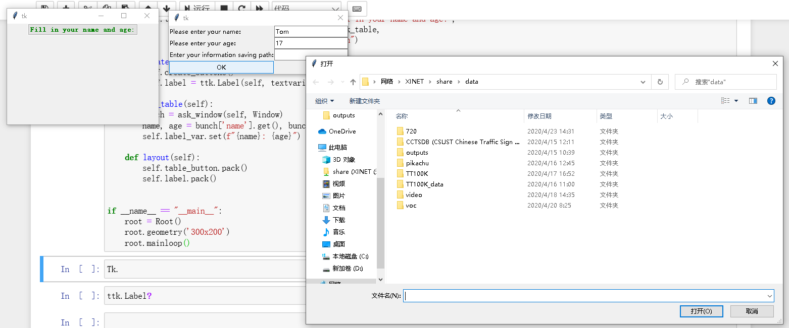

# tkinterx

[](https://github.com/xinetzone/pygui/issues) [](https://github.com/xinetzone/pygui/network) [](https://github.com/xinetzone/pygui/stargazers) [](https://github.com/xinetzone/pygui/blob/master/LICENSE) [](http://hits.dwyl.io/xinetzone/pygui)   [](https://github.com/xinetzone/pygui/graphs/contributors) [](https://github.com/xinetzone/pygui/watchers)

Use tkinter to create a handy GUI tool.

## PyPI support available

You can install the latest version using the following command:

```sh
pip install tkinterx
```

The following command is used when called:

```python
import tkinterx
```

## A sample: Record your personal information

```python
class Window(WindowMeta):
    def __init__(self, master=None, cnf={}, **kw):
        super().__init__(master, cnf, **kw)

    def create_widget(self):
        self.add_row('Please enter your name:', 'name')
        self.add_row('Please enter your age:', 'age')
        self.add_row('Enter your information saving path:', 'save_path')

    def save(self, path):
        table = self.table.todict()
        with open(path, 'w') as fp:
            json.dump(table, fp)

    def run(self):
        self.withdraw()
        name = self.table['name']
        age = self.table['age']
        save_path = str(self.table['save_path'])
        if '' in [name, age, save_path]:
            showwarning(self)
        else:
            self.save(save_path)
            askokcancel(self)


class Root(Tk):
    def __init__(self):
        super().__init__()
        self.label_var = StringVar()
        self.create_widgets()
        self.layout()

    def create_buttons(self):
        style = ttk.Style()
        style.configure("C.TButton",
                        foreground="green",
                        background="white",
                        relief='raise',
                        justify='center',
                        font=('YaHei', '10', 'bold'))
        self.table_button = ttk.Button(self, text='Fill in your name and age:',
                                       command=self.ask_table,
                                       style="C.TButton")

    def create_widgets(self):
        self.create_buttons()
        self.label = ttk.Label(self, textvariable=self.label_var)

    def ask_table(self):
        bunch = ask_window(self, Window)
        name, age = bunch['name'], bunch['age']
        self.label_var.set(f"{name}: {age}")

    def layout(self):
        self.table_button.pack()
        self.label.pack()


if __name__ == "__main__":
    root = Root()
    root.geometry('300x200')
    root.mainloop()
```

Interface presentation:



For more information: [Chinese Manual](https://www.jianshu.com/nb/45403586).
